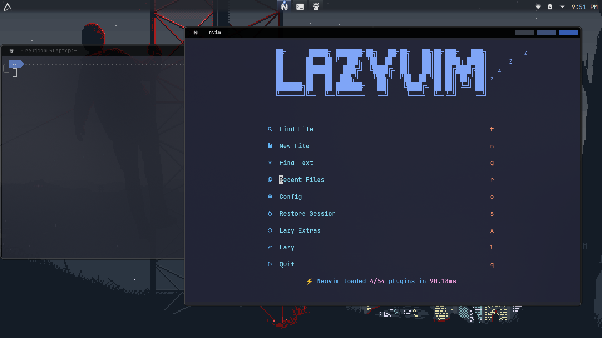

# KDE plasma config

This is my [Endeavour OS](https://endeavouros.com) with [KDE Plasma](https://kde.org/plasma-desktop/) system configs.

### Apps

I am using a number of apps on my system that will install, mainly kitty for a terminal,
lf for my file manager, [LazyVim](https://www.lazyvim.org) as my text editor, and rofi
as a app launcher.

### Theme

The system theme is largely the [Mystical Blue Theme](https://github.com/juxtopposed/Mystical-Blue-Theme) with some minor changes.
Icons are from [Yet Another Monochrome Icon Set](https://store.kde.org/p/2303161) with some custom icons for apps that were missing them.
The font used in the system is [JetBrainsMono](https://www.jetbrains.com/lp/mono/)

## Installation

The provided install script will install all the packages in `yay.txt`, it will also provide the option
to install all flatpak apps in `flatpak.txt`. It will configure the system and install the theme.

1. Clone the repo `git clone https://github.com/RJDonnison/dotfiles.git`
2. Make `install.sh` executable with `chmod +x install.sh`
3. Install system `./install.sh`

### Post Install

To fully configure the system you must apply all the themes.

1. Import keybinds from `./shortcuts.kksrc` by selecting import in shortcuts section, some apps you may need to configure manually.
2. Open Kvantum Manager and change the theme to NoMansSkyJux in Change/Delete Theme
3. Then set the application theme to kvantum in system settings
4. Also in system settings set icons to YAMIS, colors to JuxTheme, Plasma style to JuxPlasma, window decorations to JuxDeco
5. Set the fonts to use JetBrainsMono Nerd Font Mono 10pt, by adjusting all fonts in system settings.
6. Still in system settings, enable better blur under desktop effect, its recommended to apply to all window by setting force blur on all.
7. Enjoy :)

### Panel Installation

To setup the panel like the images you must install Panel Colorizer, SCP, and PlasMusic Toolbar. These can all be found in add or manage widgets.

1. Add Panel Colorizer to the panel
2. Set Panel Colorizer to hide widget
3. Open Panel Colorizer config and set preset to RJDonnisonPanel
4. Set widgets

The widgets from left to right in the images are SCP (icon com.abisource.AbiWord), spacer, Icons-Only task manager, spacer, PlasMusic Toolbar, System Tray, and Digital Clock.

## Recommended Settings

- Disable splash screen
- Set wallpaper, the images use `./images/city.gif`
- Set Login screen to Breeze, and set custom background
- Install tiler KWin script
- Set screen edges to have no action
- Set default applications
- Add a few extra virtual desktops
- Increase screen locking time

